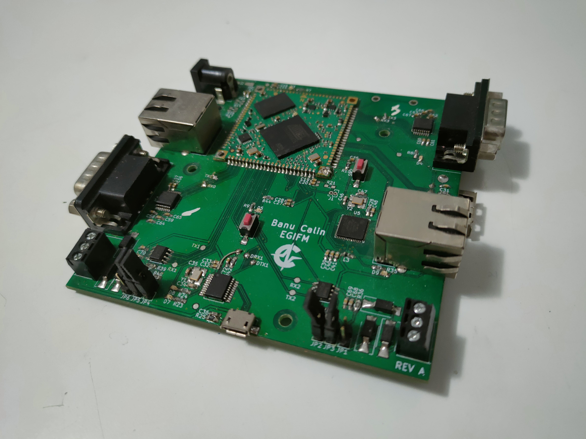
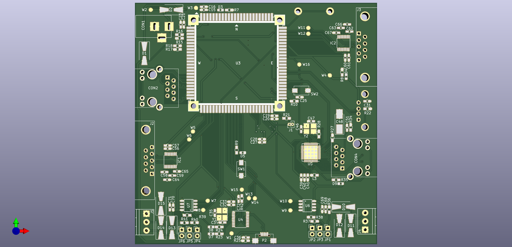
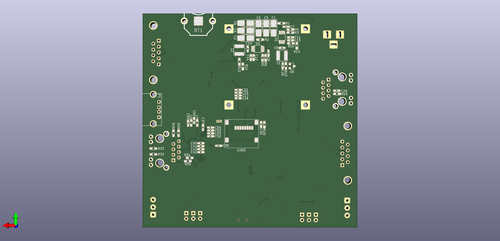

# EGIFM-Board

Extendable Gateway and Industrial Firewall for Modbus Hardware Board Project
This repo contains the PCB project for the bachelor thesis.
The PCB board based on the Acme Aria G25 Single Board Computer.

Front PCB

Back PCB
